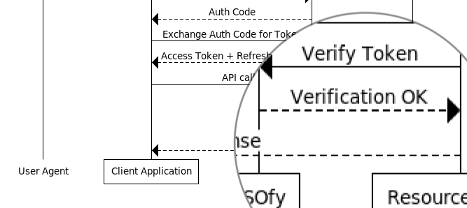

SSOfy PHP SDK
=============
#### Official [SSOfy](https://www.ssofy.com) PHP SDK for instant and efficient API access.

Read the full [documentation](https://www.ssofy.com/docs/SDK/PHP/Installation/) at SSOfy Academy.

<p align="center">
  
</p>

### Installing via Composer

```bash
composer require ssofy/php-sdk
```

## Support

Feel free to reach support with any questions regarding the integration or reporting issues.
Our technical experts are available around the clock to conduct investigations and provide
the highest quality product and service support as quickly as possible.

## Author


SSOfy and derivatives are by [Cubelet Ltd](https://cubelet.co.uk).

## License

The MIT License (MIT). Please see [License](LICENSE) File for more information.
